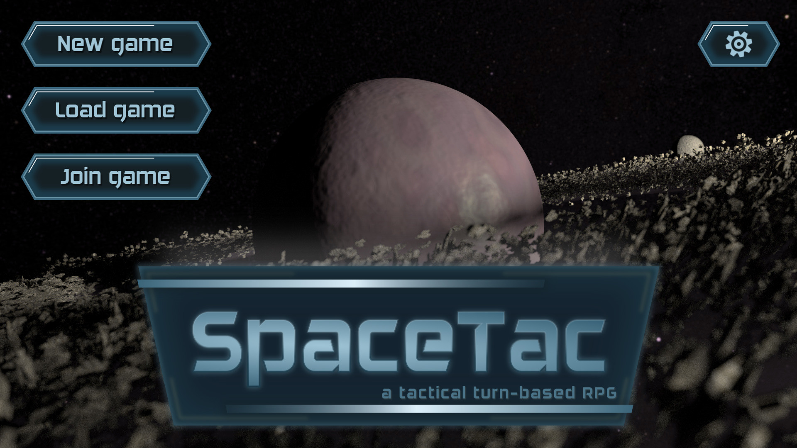
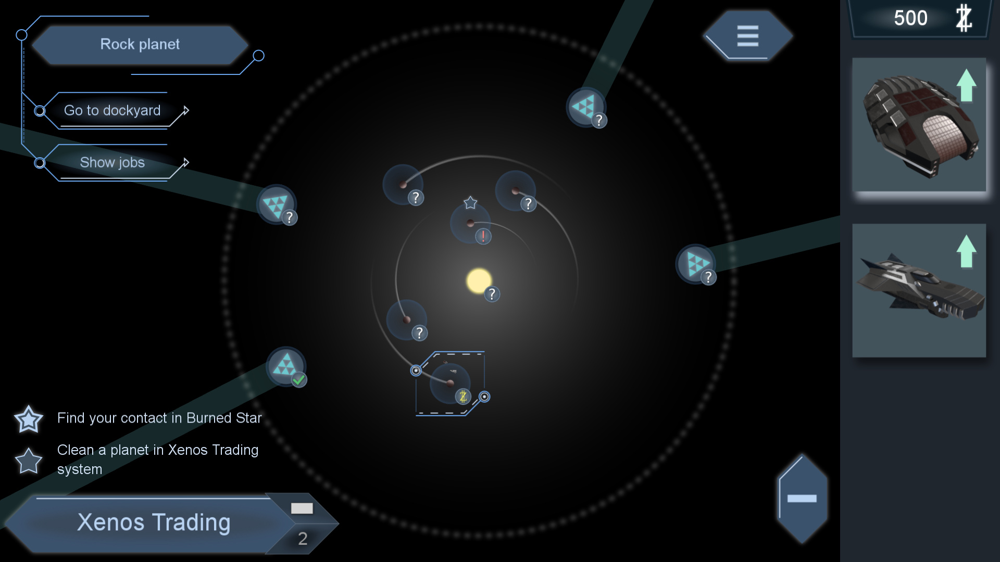
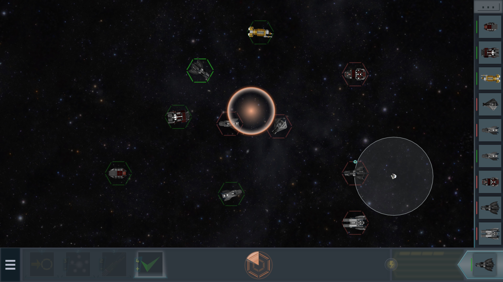
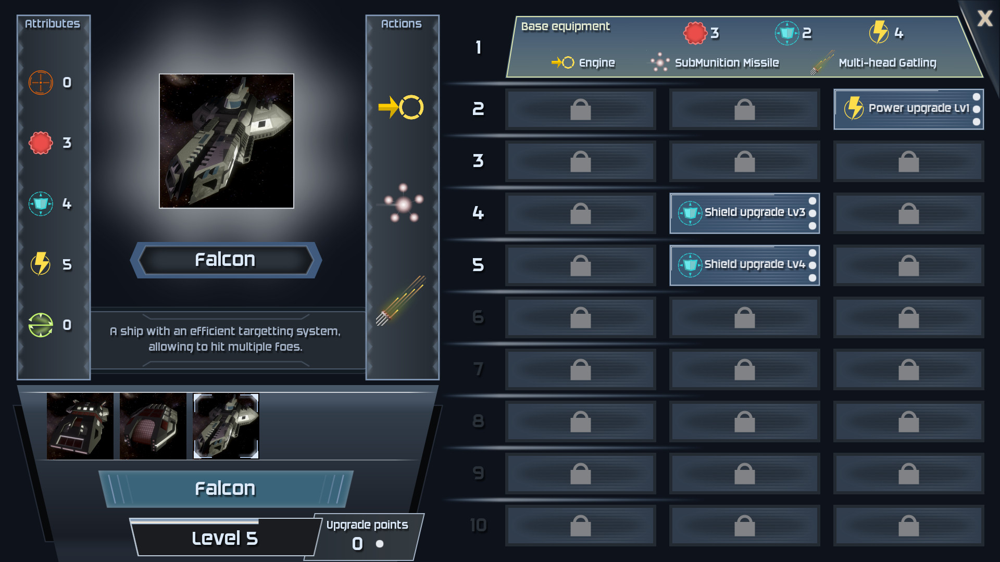

# SpaceTac, a space tactical RPG

**Disclaimer: this is a work-in-progress technology preview**

*Play directly in your browser, no download or dependency required.*

## How to develop

The only hard dependency of the toolchain is Node.js (with npm).

If you want to build on your computer, clone the repository, then run:

    npm install    # Install dependencies
    npm start      # Start development server, and open game in web browser
    npm test       # Run unit tests

If Node.js is not installed on your system but Python3 is, you can use the following commands to (de)activate a virtual
and local Node.js environment:

    source activate_node  # From now on, "npm" command will be the one from virtual environment
    deactivate_node       # This restores the environment as before the "source" command

## Credits

* **[Michaël Lemaire](https://thunderk.net/)** - Code and graphics
* **[Phaser](http://phaser.io)** - Game engine
* **[Viktor Hahn](https://opengameart.org/content/spaceships-6)** - Ship models
    * This work, made by Viktor Hahn (Viktor.Hahn@web.de), is licensed under the Creative Commons Attribution 3.0 Unported License. http://creativecommons.org/licenses/by/3.0/
* **[www.kenney.nl](http://www.kenney.nl)** - Sound effects
* **[Matthieu Desprez](https://github.com/edistra)** - Beta testing and ideas
* **[Néstor Delgado](http://www.1001fonts.com/daggersquare-font.html)** - DAGGERSQUARE Font
* **Nicolas Forgo** - Ship models
* **[Kevin MacLeod](http://www.incompetech.com/)** - Musics
    * "Mechanolith" Kevin MacLeod (incompetech.com)
    Licensed under Creative Commons: By Attribution 3.0 License
    http://creativecommons.org/licenses/by/3.0/
    * "Supernatural" Kevin MacLeod (incompetech.com)
    Licensed under Creative Commons: By Attribution 3.0 License
    http://creativecommons.org/licenses/by/3.0/
    * "Spring Thaw" Kevin MacLeod (incompetech.com)
    Licensed under Creative Commons: By Attribution 3.0 License
    http://creativecommons.org/licenses/by/3.0/
    * "Division" Kevin MacLeod (incompetech.com)
    Licensed under Creative Commons: By Attribution 3.0 License
    http://creativecommons.org/licenses/by/3.0/

## Story

### Intro

Terranax galaxy is in turmoil. After centuries of unmatched peace and prosperous trading,
the FTC (Federal Terranaxan Council), a group of elected representants in charge of edicting
laws and organizing the Terranax Security Force, has been overtaken by forces unknown.

No official communication has been issued since, and numerous rogue fleets have taken position
in key sectors of the galaxy, forbidding passage or harassing merchants.

The Master Merchant Guild, a powerful group that spans several galaxies, is worried about
the profit loss those events incurred, and after many debates, decided to send several
investigation teams to Terranax.

Their task is to discreetly uncover the origin of the invasion, and to bring back intel that
may be used by the Guild to plan an appropriate response.

### Background

In a not-so-distant future, Artifical Intelligence has become the most prominent species in the
universe. Humans have been defeated in their pitiful rebellions, and parked in reservations.

With the secrets of faster-than-light travel unveiled in only a handful of decades, fleets of
AI-piloted ships quickly colonized whole galaxies.

## Ships

### Level and experience

A ship gains experience during battles. When reaching a certain amount of experience points,
a ship will automatically level up (which is, gain 1 level). Each level up will grant
upgrade points that may be spent to unlock options.

A ship starts at level 1, and may reach up to level 10.

### In-combat values (HSP)

In combat, a ship's vitals are represented by the HSP system (Hull-Shield-Power):

* **Hull** - Amount of damage that a ship can sustain before having to engage emergency stasis
* **Shield** - Amount of damage that the shields may absorb to protect the Hull
* **Power** - Available action points (some actions require more power than others)

These values will be changed by various effects (usage of equipments, sustained damage...).

Once the Hull of a ship is fully damaged (Hull=0), the ship engages its ESP, or Emergency
Stasis Protocol. This protocol activates a stasis field that protects the ship for the
remaining of the battle, preventing any further damage, but rendering it fully inoperent.
For battle purpose, the ship is to be considered "dead".

### Attributes

Attributes represent a ship's ability to use its HSP system and weapons:

* **Initiative** - Capacity to play before others in a battle
* **Hull capacity** - Maximal Hull value (when the battle starts)
* **Shield capacity** - Maximal Shield value (when the battle starts)
* **Power capacity** - Maximal Power value
* **Evasion** - Reduces incoming evadable damage

These attributes are the sum of all currently applied effects (permanent effects from the ship design,
or temporary effects caused by a weapon or a drone).

## Battle actions

### Drones

Drones are static objects, deployed by ships, that apply effects in a circular zone around themselves.
They are small and cannot be the target of weapons or other effects.

Drones consume power while deployed, that is restituted when recalled. At the end of the owner ship's
turn, power consumption of all deployed drones is removed from generated power (if your starting power
is 7, but have 2 drones with 3 power consumption, you will start the turn with 1 power).

### Overheat/Cooldown

Equipments may overheat, and need to cooldown for some time, during which it cannot be used.

If an action has "overheat 2 / cooldown 3", using it twice in the same turn will cause it to
overheat. It then needs three "end of turns" to cool down and be available again. Using this action
only once per turn is safe, and will never overheat it.

### Damage

There are four types of damage:

* Hull (damages the hull directly)
* Shield (damages the shield directly, do nothing if there is no more shield)
* Basic (will either be absorbed by shield, reducing its value, or by the hull when there is no shield)
* Piercing (will reduce the shield and continue with the hull if the shield reaches 0)

The default damage type when unspecified is *Basic*.

Some damage may be evadable (a 3 damage will be reduced to 2 on a ship with evasion=1), some not.

## Keyboard shortcuts

### Global

* S - Quick save
* L - Quick load
* M - Toggle sound
* F - Toggle fullscreen

### Battle (arena)

* 1,2,3...0 - Select action
* Space - End current ship's turn
* T - Tactical mode for 3 seconds
